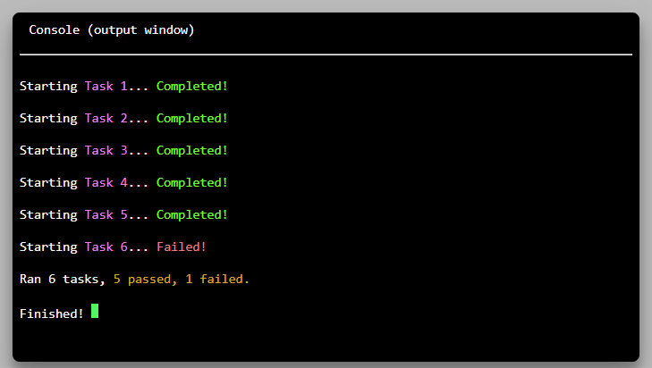

# signalr-web-console



A web based output console for displaying progress messages when executing tasks using ASP.NET C# and SignalR.

# What is it?

This repository contains a simple ASP.NET web application using SignalR to send status/progress messages to the client.

This feature is useful when a user triggers one or more time consuming backend processes, usually between 10-30 seconds.

In addition to just displaying messages, the project includes a console for printing the messages a.k.a web console.

Do note, the console is read-only  - for printing messages.


# How to run

Clone the repo, restore nuget packages (clean & build) and run!

(ASP.NET - 4.7.2 .Net Framework)


# How does it work?

When you launch the project, a page will load with a button and a console window.

When you click on the button, an AJAX request will be posted to the server and time consuming tasks will be simulated. As each task completes a status message will be sent to the console hosted on the page via SignalR.


# How do I implement it?

Replicating this functionality in your own project is straight forward. 

First, Install the Microsoft ASP.NET SignalR package from nuget:
```
PM> Install-Package Microsoft.AspNet.SignalR -Version 2.1.2
```


## Hubs Folder

* Copy the **Hubs** folder into your root directory, it has the following files:

    * **Startup.cs** - This enables your web application to use SignalR
    * **ProgressHub.cs** - A derived instance of a SignalR Hub - all messaging is done here.

## Controller

* Copy the **HomeController.cs** into your project:
    
    * The controller contains two action methods, _Index()_ and _DoWork()_:
    * **Index()** - just renders the view.
    * **DoWork()** - triggered by a button on the view that will simulate "time consuming tasks" and send progress messages back to the web console on the view via SignalR.

## View

* Copy the **Views/Home/Index.html** file into your project:

    * There are 3 javascript file references, **JQuery**, **jQuery.signalR** and an internal endpoint "**~/signalr/hubs**"
    * The "**~/signalr/hubs**" endpoint is generated by your application and contains the information needed to connect to the hubs, eg '_ProgressHub_'.
    * You can use any version of JQuery as long as it is version 1.6.4 or above.
    * The view contains all the required javascript code to connect and process messages from the signalR hub.

## Stylesheet
* Copy the **Content/css/site.css**  file into your project:
    * This stylesheet is referenced by the view file above.
    * The stylesheet contains all the styles for the console - prefixed with **.ww-console**


## That's it!
